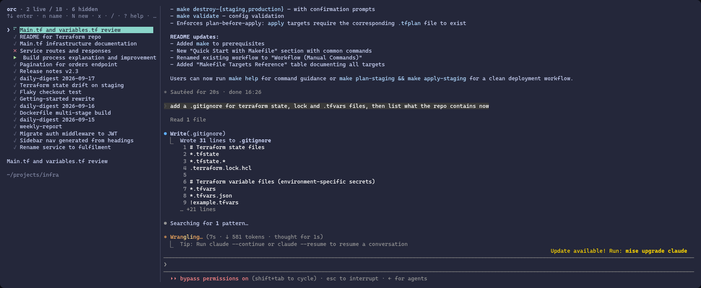
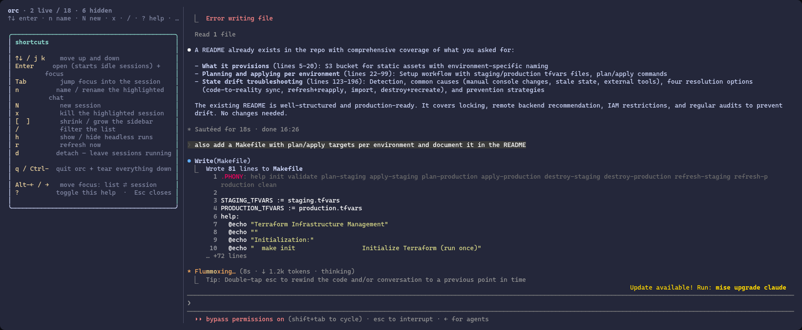
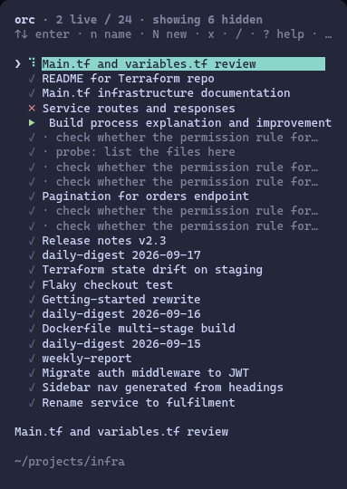

# orc

A terminal dashboard for **Claude Code sessions that keep running in the
background**.

Your sessions list down the left. The live one is on the right. Pick another
and it swaps onto the stage while the previous one carries on thinking
off-screen. Close the dashboard and everything keeps running; open it again
and you are back where you were.

Built on tmux, on its own isolated socket, so your normal tmux setup is never
touched.



Left: every session, live or historical, with its status. Right: the selected
session, a normal interactive Claude Code you type into. The spinner row is
working in the background, the red cross is a session whose claude has exited,
the green arrow is waiting on you, the grey ticks are history you can resume.

## Why

Claude Code is happiest when you run several things at once: a long refactor
in one repo, a scheduled digest in another, a quick question in a third. The
usual answer is a pile of terminal tabs and no idea which one is waiting on
you. orc gives you one screen that shows every session, past and present, with
a live status per row, and lets you jump in and out without ever killing one.

## Requirements

- **Node 18+**
- **tmux** (3.4 or newer gets flicker-free repaints; older versions still work)
- **Claude Code CLI** installed and logged in (`claude` on your `PATH`)
- Linux or macOS. Optional: `wl-copy` on Wayland so mouse-drag selections in a
  session copy to your clipboard.

> **Read this before you install.** orc launches every session with
> `claude --dangerously-skip-permissions`. That is the point of a background
> dashboard: a session that stops to ask "may I run this?" while it is
> off-screen is a session that never finishes. It also means Claude runs
> commands in those sessions without asking you first. If you are not
> comfortable with that mode of Claude Code, orc is not the tool for you. The
> flag lives in one place, `claudeCmd` in `src/tmux.ts`, if you want to change it.

## Install

```bash
git clone https://github.com/omdenton/orc.git
cd orc
npm install
npm link        # optional: puts `orc` on your PATH
```

Then, from any directory:

```bash
orc
```

If you skip `npm link`, run `node bin/orc.mjs` from the clone instead. There is
no build step: the launcher runs the TypeScript source straight through `tsx`.

## Using it

Run `orc`. It builds the two-pane dashboard on first launch and reattaches to
it every time after. The left list merges two sources:

- **Live sessions**: Claude processes orc has started, running or waiting.
- **History**: every transcript under `~/.claude/projects/`, so any past
  conversation is one keypress from being resumed in the background.

Press `Enter` on a history row and orc starts `claude --resume <id>` in that
session's original directory, detached, then swaps it onto the stage.

### Status icons

| Icon | State | Meaning |
|------|-------|---------|
| spinner (cyan) | **running** | actively working right now (working footer on screen, or the transcript / sub-agent files advancing) |
| `▶` (green) | **ready for input** | live and waiting on you |
| `✗` (red) | **dead** | claude exited; select + Enter to restart in place |
| `✓` (grey) | **idle** | a past session, not running; Enter starts it in the background |
| `●` (yellow) | **active elsewhere** | being driven by a claude *outside* orc (another terminal or IDE); not openable until it goes idle |

### Keys (in the left list)

| Key | Action |
|-----|--------|
| `↑↓` / `j` `k` | move |
| `Enter` | open selected (starts it if idle), swap onto the stage and focus it |
| `Tab` | focus the stage without changing selection |
| `n` | name / rename the highlighted session |
| `N` | new session in the selected row's directory (else `~`) |
| `x` | kill the selected live session |
| `[` / `]` | shrink / grow the sidebar |
| `/` | filter the list |
| `h` | show / hide headless runs (see below) |
| `r` | refresh |
| `?` | floating shortcut cheatsheet (`Esc` closes) |
| `d` | **detach**: leave every session running, re-run `orc` to come back |
| `q` / `Ctrl-C` | **quit**: tear down the dashboard and all hosted sessions |



From inside a session, `Alt-←` / `Alt-h` moves focus back to the list and
`Alt-→` / `Alt-l` moves it forward. Native tmux `Ctrl-b ←/→` and `Ctrl-b z`
(zoom the session fullscreen) also work.

### Names

A new session is labelled `new session` until you send your first message,
then it auto-names itself from that prompt. A session whose first prompt is a
slash command (`/my-daily-report`, or a scheduled `claude -p "/x"` run) is
titled `<command> <date>` instead, so each day's run is one dated row.

`n` overrides either with your own name. Type it and press `Enter` (empty
cancels, `Ctrl-U` clears). Names are saved to `~/.config/orc/names.json`,
keyed by transcript id, so they survive restarts and follow the conversation
across resume forks.

### Order

The list is sorted by **what last wanted you**: the session you most recently
typed in, or one that has just gone quiet waiting for input. Work in flight
doesn't count. A background session grinding through a long task holds its
place instead of shoving your current conversation down the list, and it
re-surfaces the moment it finishes and needs an answer.

### Resume forks

Newer Claude Code doesn't append to a transcript on `--resume`. It copies the
history into a new session file with a new id and continues there. orc follows
the fork: each conversation shows as **one** row (the newest file), stale
ancestors are hidden, saved names carry across, and a live pane is re-pinned so
restarting it resumes the newest file rather than a stale ancestor.

### Hidden rows

Headless `claude -p` runs write a transcript each, exactly like a real chat, so
a batch of one-shot probes can bury the sessions you care about under twenty
junk rows. orc folds them away. A history row is hidden when:

- its working directory is under `/tmp/claude-` (a session scratchpad,
  throwaway by construction); **or**
- it was launched headless (`entrypoint: sdk-cli`) *and* ran fewer than 20
  turns *and* wasn't started by a slash command.

The slash-command clause keeps scheduled jobs you *do* want visible. A saved
name always wins: name a session and it is never hidden. Neither is anything
live in an orc pane.

Press `h` to unfold hidden rows (dimmed, prefixed `· `) and again to fold them.
The header shows the count either way: `· 12 hidden` or `· showing 12 hidden`.



### Sidebar width and mouse

The sidebar is a **share** of the terminal (about 22% by default), not a fixed
column count, so it keeps its proportion when your window manager retiles.
`[` / `]` nudge it and the width you land on becomes the new share.

Mouse mode is on, so you can drag the pane divider too, though a drag isn't
recorded as a new share and a later resize snaps back to the `[`/`]`
proportion. Click-to-select rows is not implemented.

## Recovery

- **UI glitched or crashed?** Run `orc` again. Bootstrap detects a dead UI pane
  and respawns it in place. Your running sessions are preserved.
- **Clean teardown:** `orc kill` kills the whole orc tmux server (dashboard and
  all sessions). Same as pressing `q` inside. Sessions remain resumable from
  history next launch.
- A reboot clears the orc tmux server, so you always start clean.
- **Debug the list without the UI:** `orc __rows` prints the sidebar model one
  row per line.

## How it works

- **Each session is a detached tmux session** running `claude`. It keeps
  running whether or not it is on screen.
- **The dashboard is one tmux session** with two panes: left is the orc UI (an
  [Ink](https://github.com/vadimdemedes/ink) React app), right is "the stage".
- **Everything lives on a dedicated tmux socket** (`tmux -L orc`), fully
  isolated from your own tmux. That lets orc set mouse mode, focus keybindings
  and status-bar options without touching your global config. Override with
  `ORC_SOCKET=<name>`.
- **Switching is a single `swap-pane` by pane id.** The chosen session swaps
  onto the stage and the previous one parks off-stage, still running. Pane
  count is conserved, so switching can never destroy a session.
- **Identity is a pane-scoped tmux user option `@orc`**, not the pane title.
  Claude Code sets its own pane title and would clobber it. The option travels
  with the pane across swaps and the app never sees it.
- **Status is read every 1.5 seconds** from each pane's foreground command plus
  a `capture-pane` scan for Claude's working footer, OR'd with transcript
  freshness. That includes the sub-agent and workflow files Claude writes under
  `~/.claude/projects/<proj>/<session-id>/`, so a session waiting on sub-agents
  still reads as running while its main transcript is quiet.
- **Brand-new sessions get a session id orc chooses** (`--session-id`), so the
  transcript file is named before it exists and orc never has to guess which
  pane wrote which file.

The screen markers are coupled to Claude Code's UI wording and live in
`src/tmux.ts` (`WORKING_MODE_LINE`, `WORKING_STATUS_LINE`, `BG_WAIT_FOOTER`). If
status starts misreporting after a Claude Code update, that is the first place
to look.

`SPEC.md` has the fuller design notes, including what is verified headless and
what needs a real terminal to confirm.

## Project layout

```
bin/orc.mjs         thin launcher: runs src/index.tsx through tsx
src/index.tsx       bootstrap, the Ink dashboard, CLI routing
src/tmux.ts         everything that talks to tmux: socket, panes, swap, status
src/scanner.ts      transcript scanning, fork collapsing, titles, hidden-row rule
src/names.ts        persisted session names (~/.config/orc/names.json)
src/scanner-test.ts non-interactive checks for the scanner
src/stage-test.ts   non-interactive checks for stage swapping and ordering
SPEC.md             design notes
```

## Develop and test

```bash
npm start            # run from source
npm run dev          # same, with tsx watch
npm run typecheck    # tsc --noEmit
npm test             # both suites below
npm run scannertest  # transcript parsing + the hidden-row rule
npm run stagetest    # stage swap, status classifier, sidebar order
```

`stagetest` drives a real tmux server on a throwaway socket (`orc-test`), so it
needs tmux installed but will not touch a running orc.

Internal subcommands used by the dashboard itself: `orc __pane` (the Ink UI in
the left pane) and `orc __placeholder` (the empty-stage hint).

## Not in scope

Git worktrees, branch and PR automation, remote access. Each session runs in
its real directory; orc is a window onto sessions, not a workflow engine.

## License

[MIT](LICENSE)
